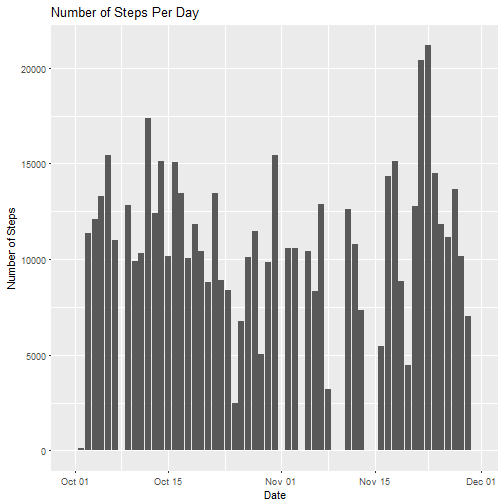
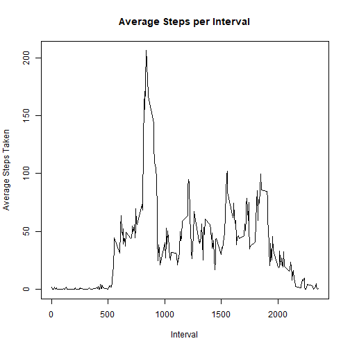
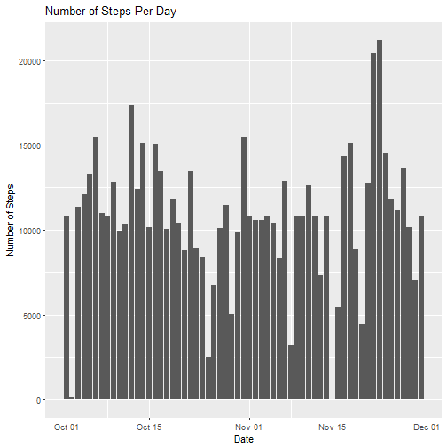
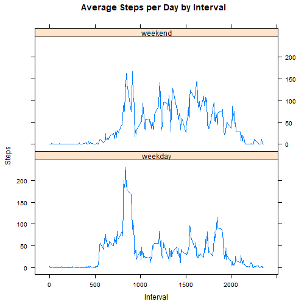

# Peer Graded Assignment 1

## Loading and Processing Data


```r
activity <- read.csv("activity.csv")
```

## Calculating the mean total number of steps per day

#### 1. Calculating Steps Per Day

```r
require(reshape2)
StepsPerDay<-melt(tapply(X = activity$steps,INDEX = activity$date,FUN = sum,na.rm = TRUE))
StepsPerDay$Var1<-as.Date(StepsPerDay$Var1,"%Y-%m-%d")
names(StepsPerDay)<- c("Date","Num")
```

#### 2. Making a histogram of the total number of steps per day

```r
require(ggplot2)
ggplot(data = StepsPerDay,mapping = aes(x = Date,y= Num))+
  geom_histogram(stat = "identity")+
  labs(title = "Number of Steps Per Day",y="Number of Steps")
```

```
## Warning: Ignoring unknown parameters: binwidth, bins, pad
```



#### 3. Mean and Median of total number of steps taken per day

```r
Mean<-mean(StepsPerDay$Num)
Median<-median(StepsPerDay$Num)
print(paste("Mean:",Mean))
```

```
## [1] "Mean: 9354.22950819672"
```

```r
print(paste("Median:",Median))
```

```
## [1] "Median: 10395"
```

## Average Daily Activity Pattern

#### 1. Making a time series plot of the 5-minute interval (x-axis) and the average number of steps taken, averaged across all days (y-axis)

```r
AvgPerInterval <- melt(tapply(X = activity$steps,INDEX = activity$interval,FUN = mean,na.rm = TRUE))
names(AvgPerInterval)<- c("Interval","Average")
plot(x = AvgPerInterval$Interval,y = AvgPerInterval$Average,type = "l",ylab = "Average Steps Taken",main = "Average Steps per Interval",xlab = "Interval")
```



#### 2. Maximum Number of Steps in a particular Interval


```r
Max<-max(AvgPerInterval$Average,na.rm = TRUE)
print(paste("Interval in which Max Steps are taken:",AvgPerInterval[AvgPerInterval$Average == Max,1]))          
```

```
## [1] "Interval in which Max Steps are taken: 835"
```

```r
print(paste("Maximum number of Steps in a Particular Interval:",round(Max,2)))
```

```
## [1] "Maximum number of Steps in a Particular Interval: 206.17"
```

## Imputing missing values

#### 1. Number of rows with missing Values

```r
nna <- sum(is.na(activity$steps))
print(paste("Number of Rows with Missing Vallues:",nna))
```

```
## [1] "Number of Rows with Missing Vallues: 2304"
```

#### 2. Strategy to fill the missing Value: Replace NA with mean of that interval

#### 3. Filling the missing Values

```r
activityNew <- activity
for(i in which(is.na(activity$steps)))
activityNew[i,1]<-round(AvgPerInterval[(AvgPerInterval$Interval==activity$interval[i]),2],0)
```

#### 4. Analysis after entering missing Values

```r
StepsPerDayN<-melt(tapply(X = activityNew$steps,INDEX = activityNew$date,FUN = sum,na.rm = TRUE))
StepsPerDayN$Var1<-as.Date(StepsPerDayN$Var1,"%Y-%m-%d")
names(StepsPerDayN)<- c("Date","Num")
require(ggplot2)
ggplot(data = StepsPerDayN,mapping = aes(x = Date,y= Num))+
  geom_histogram(stat = "identity")+
  labs(title = "Number of Steps Per Day",y="Number of Steps")
```

```
## Warning: Ignoring unknown parameters: binwidth, bins, pad
```



```r
print(paste("Mean:",mean(StepsPerDayN$Num)))
```

```
## [1] "Mean: 10765.6393442623"
```

```r
print(paste("Median:",median(StepsPerDayN$Num)))
```

```
## [1] "Median: 10762"
```
Thus, after replacing missing values, we see that there is a slight increase in the estimates of the total daily steps per day, as an increase in the mean is witnessed.

## Finding patterns between weekends and weekdays

#### 1. Create weekends and weekday variables

```r
require(lattice)
activityNew$date<-as.Date(activityNew$date,"%Y-%m-%d")
weekdays <- c("Monday", "Tuesday", "Wednesday", "Thursday", "Friday")
activityNew$day <- as.factor(ifelse(is.element(weekdays(activityNew$date),set = weekdays),"weekday","weekend"))
AvgStepsW <- aggregate(steps ~ interval+day,data = activityNew,FUN = mean)
xyplot(AvgStepsW$steps~AvgStepsW$interval|AvgStepsW$day,main="Average Steps per Day by Interval",xlab="Interval",ylab="Steps",type="l",layout=c(1,2))
```


